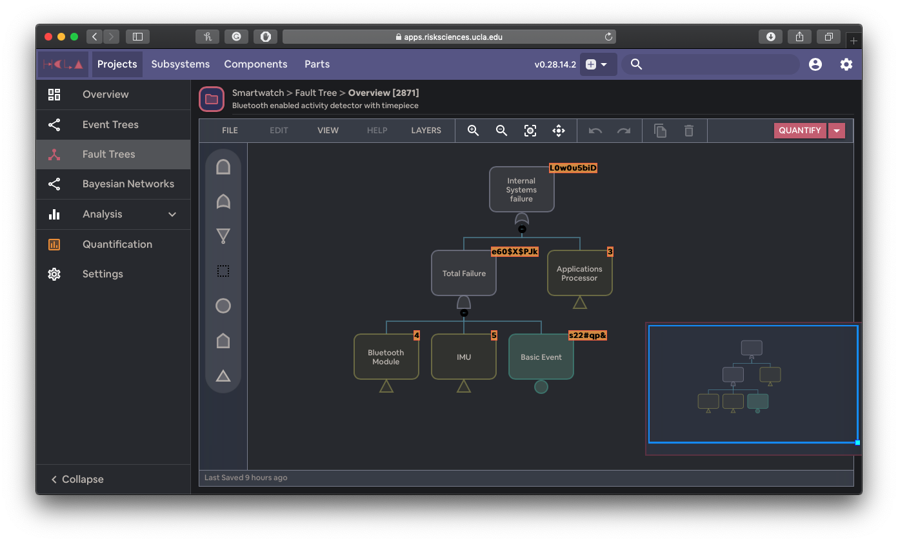

## 👀 Overview

[The B. John Grarrik Institute for The Risk Sciences](https://www.risksciences.ucla.edu/) (GIRS) is a research lab at UCLA that studies the quantification and management of the risk of complex natural and engineered systems and processes. I joined GIRS as a student developer to design, prototype, and build NASA Jet Propulsion Laboratory's internal software for system reliability analysis.

Worked as a developer as well as a UI designer on variety of features. Invented a tree traversal algorithm for Human Failure Analysis.

## 🌟 Highlights

Here are some of stuff I implemented during my summer internship at GIRS.

### 🌲 Tree Encoding/Decoding

Every tree node has properties such as name, descriptoion, probablity etc. I wrote an encoder to convert the tree objects into JSON format as well as a decoder to do the reverse.

### ✏️ Node Editor

I've coded and designed the node editting feature using React.

### ♻️ TypeScript Migration

When I joined the lab the code base was 100% JavaScript. To provide type safety and improve the dev devlocity, I've migrated nearly 80% of the code base to TypeScript.
